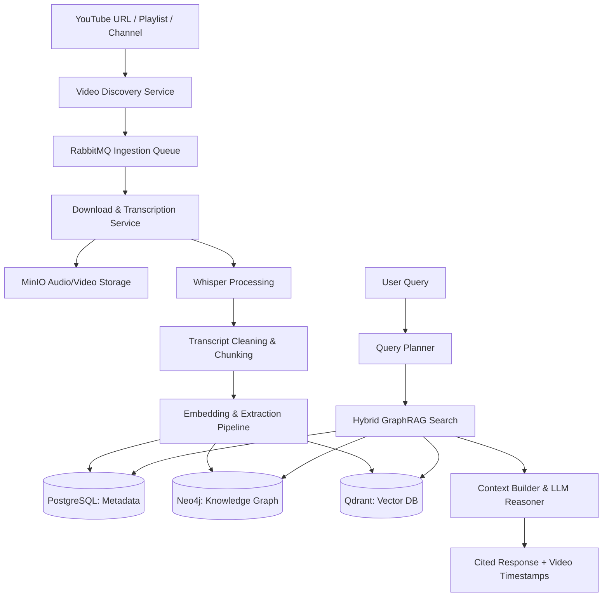

# System Architecture: Brainy 1.0

This document describes the structural design, data flow, event systems, and components of the Brainy 1.0 platform.

## High-Level Architecture Flow Diagram

## Service Architecture

### 1. Ingestion Engine
- **Discovery Service**: Polls or ingests channels/playlists, resolves video metadata, and pushes discovery messages to RabbitMQ.
- **Download Service**: Fetches raw audio using specialized libraries (e.g., `yt-dlp`), streams to MinIO object storage.
- **Whisper Service**: Transcribes audio files asynchronously, generating timestamp-aligned transcript segments.

### 2. Knowledge Extraction Pipeline
- **Transcript Cleaner**: Normalizes spelling, sentence boundary issues, and speaker overlaps.
- **Semantic Chunker**: Splits transcripts based on semantic shifts rather than token count.
- **Entity & Relation Extractor**: Uses LLMs/small models to extract entities (Who, What, Where) and relationships (Subject-Predicate-Object).
- **Triplet Builder**: Builds structured relationships to populate the knowledge graph.

### 3. Database Layer (The Triad)
- **PostgreSQL**: Stores relational models, user sessions, system config, run logs, and metadata mapping.
- **Neo4j**: Represents semantic knowledge as a graph of nodes (Entities) and edges (Relations).
- **Qdrant**: Stores vector embeddings for semantic chunks, entity descriptions, and relationship contexts.

### 4. GraphRAG Retrieval & Reasoning Engine
- **Query Planner**: Analyzes user queries to determine search scope (local vs. global graph search).
- **Hybrid Retriever**: Runs parallel vector similarity searches (Qdrant) and graph traversals (Neo4j).
- **LLM Context Integrator**: Packages retrieved triplets, text chunks, and metadata into a dense prompt.
- **Citation Engine**: Automatically references source videos, timestamps, and confidence scores.

## Data & Event Flow

### Ingestion Flow (Event-Driven)
1. User provides a YouTube Playlist URL.
2. `Discovery Service` fires an event `playlist.discovered` containing video URLs.
3. Workers pick up `video.ingest` tasks, download audio, and save to MinIO.
4. On download complete, `video.downloaded` event triggers Whisper.
5. Whisper transcribes and outputs `transcript.completed` with timestamps.
6. The extraction worker processes the transcript, chunking it, creating embeddings, and extracting entities/relations.
7. Transactional writes update Neo4j, Qdrant, and PostgreSQL simultaneously.

### Retrieval Flow (Synchronous RPC / API)
1. User submits query: *"What are the core scaling issues of Kubernetes discussed in 2026?"*
2. The API parses keywords and runs vector search on Qdrant.
3. The closest chunks point to specific Neo4j nodes.
4. Neo4j executes Cypher queries to retrieve 1-hop and 2-hop relationships from those nodes.
5. The combined facts (triplets + source chunks) are formatted as context for the LLM.
6. The LLM generates a comprehensive response citing specific timestamps.
