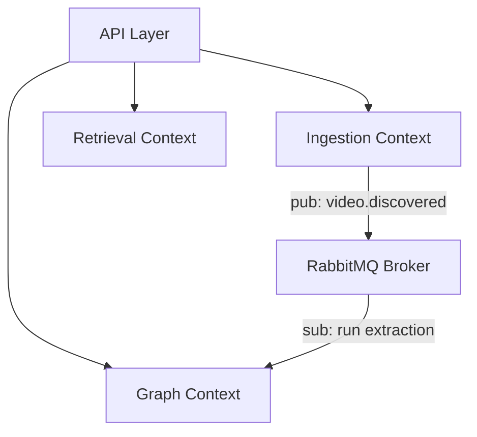

# Backend System Architecture & Modular Design

This document details the modular backend architecture for Brainy 1.0. It is designed as a **Modular Monolith** to enable rapid development initially, while maintaining strict domain separation to support a future microservices migration.

---

## 1. Folder Structure Mappings (`src/`)

```text
src/
├── api/             # Web API Layer (routers, request schemas, validation middleware)
├── application/     # Application Logic Layer (use cases, service interfaces, orchestrations)
├── domain/          # Pure Domain Domain Layer (entities, value objects, domain exceptions)
├── infrastructure/  # Infrastructure Adapters (database clients, cache, external APIs)
├── ingestion/       # Ingest Engine Module (yt-dlp, video discovery, file streaming)
├── graph/           # Graph Engine Module (Neo4j mappings, Ontologies, Cypher scripts)
├── retrieval/       # Retrieval Module (Qdrant interfaces, hybrid search algorithms)
├── ai/              # AI Processing Module (Whisper API/local, LLM extraction pipelines)
├── workflows/       # Pipeline Workflows & Worker Task executors (RabbitMQ consumers)
├── observability/   # OpenTelemetry configurations, metrics trackers, logging setups
├── security/        # Auth, credentials validation, CORS, rate limits
├── storage/         # MinIO / S3 object client adapters
├── shared/          # Shared utilities (string formatters, typing, dates helpers)
└── configs/         # Global config files, environment variables loader
```

## 2. Bounded Contexts & Service Boundaries

To enable future microservices extraction, each module must maintain independent database tables and data access routines.



- **Ingestion Context**: Manages raw video metadata, download tracking, and storage files. Database: Relational schema in PostgreSQL (`videos`, `tasks`).
- **Graph & Extraction Context**: Manages semantic ontologies, entities, and relations. Database: Neo4j.
- **Retrieval Context**: Manages similarity search indexing and query planning. Database: Qdrant.

## 3. Dependency Rules & Injection (Clean Architecture)

We enforce strict unidirectional dependency rules:

- **Domain** is completely independent. It must not import from `api`, `application`, or `infrastructure`.
- **Infrastructure** implements interfaces declared in `application`.
- We use **Dependency Injection (DI)** (via FastAPI's `Depends` or simple constructor injections) to pass mock adapters during testing.

## 4. Event Contracts (RabbitMQ Topics)

Modules communicate asynchronously via RabbitMQ topic exchanges.

### Event: `video.discovered`

- **Routing Key**: `ingestion.video.discovered`
- **Payload**:

```json
{
  "video_id": "uuid-v4",
  "youtube_url": "string",
  "channel_id": "string",
  "published_at": "iso-date"
}
```

### Event: `transcription.completed`

- **Routing Key**: `ai.transcription.completed`
- **Payload**:

```json
{
  "video_id": "uuid-v4",
  "audio_file_path": "string",
  "transcript_path": "string"
}
```

## 5. Future Microservices Migration Strategy

To extract a module (e.g., the Ingestion Engine) into a standalone service:

1. **Database Separation**: Split the PostgreSQL schemas into isolated databases.
2. **Decoupled Commits**: Separate the folder path `/src/ingestion/` into a dedicated repository.
3. **RPC/Event Integrations**: Replace internal method calls from other contexts with REST API requests or RabbitMQ event signals.
