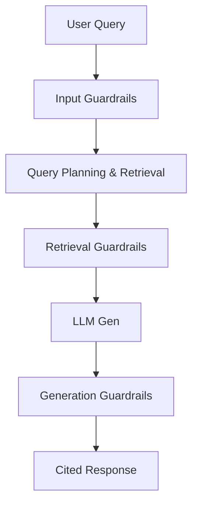

# AI Evaluation Framework & Guardrails Architecture

This document defines the evaluation metrics, test datasets, and runtime guardrails used to guarantee quality, safety, and reliability in Brainy 1.0.

---

## 1. AI Evaluation Framework

The system utilizes automated evaluation pipelines running asynchronously or during CI/CD cycles to assess performance.

### Ingestion Evals
- **Download Success Rate**: Percentage of successfully downloaded video streams from resolved URLs. Target: $\ge 98\%$.
- **Transcript Quality (Word Error Rate - WER)**: Measured by comparing Whisper outputs against human-verified "golden transcripts" (e.g., `evals/datasets/transcription_golden.json`). Target: $\le 8\%$.
- **Chunk Quality**: Coherence of semantic chunks, measuring semantic similarity within a chunk and sharp variance at boundaries.
- **Processing Latency**: Total pipeline time from discovery to chunking. Target: $\le 0.5 \times \text{video duration}$.
- **Failed Jobs Ratio**: Dead-letter exchange rate in RabbitMQ. Target: $\le 1.5\%$.

### Extraction Evals
- **Entity Extraction Accuracy (Precision/Recall/F1)**: Evaluated using standard named entity recognition (NER) benchmarks against test videos. Target F1: $\ge 90\%$.
- **Relation Extraction Accuracy**: Precision of Subject-Predicate-Object relations. Target: $\ge 85\%$.
- **Triplet Correctness**: Structural correctness of extracted triplets compared to a reference ontology.
- **Hallucinated Entities**: Rate of entities introduced by LLM extraction not present in the source text. Target: $0\%$.
- **Duplicate Entities**: Rate of near-duplicate nodes (e.g., "Kubernetes" and "k8s") not merged during extraction. Target: $\le 2\%$.

### Retrieval Evals
- **Recall@K & Precision@K**: Rate of relevant chunks retrieved in top $K$ results.
- **Mean Reciprocal Rank (MRR)**: Evaluates the position of the first highly relevant document.
- **Context Relevance**: LLM-as-a-judge score evaluating whether the retrieved context contains information to answer the query. Target: $\ge 92\%$.
- **Retrieval Latency**: Milliseconds to fetch data from Qdrant, Neo4j, and PostgreSQL. Target: $\le 300\text{ms}$.

### GraphRAG Evals
- **Citation Correctness**: Verification that playback link timestamps match the exact video range containing the cited text chunk. Target: $\ge 99\%$.
- **Graph Traversal Quality**: Density and precision of nodes traversed to answer multi-hop queries.
- **Multi-hop Reasoning Accuracy**: Ability to answer questions requiring synthesis of facts separated by multiple connections.
- **Response Grounding**: Percentage of facts in the response that map back to active nodes in Neo4j. Target: $100\%$.

### LLM Evals
- **Hallucination Rate**: Frequency of output information that cannot be supported by the retrieved context. Target: $0\%$.
- **Faithfulness**: LLM-as-a-judge score measuring if the response is mathematically consistent with facts in the context. Target: $\ge 95\%$.
- **Completeness (Recall)**: Extent to which the LLM addressed all questions in the user query. Target: $\ge 90\%$.
- **Correctness**: Absolute factual accuracy evaluated against a curated gold standard.
- **Response Latency**: End-to-end user query latency including LLM token generation. Target: $\le 3\text{s}$ (Time To First Token $\le 500\text{ms}$).

---

## 2. Guardrails System

Guardrails run in-line in the request-response lifecycle to enforce boundaries.

### Input Guardrails
- **URL Validation**: Strict regex matching for valid YouTube video/playlist/channel patterns. Reject non-YouTube links.
- **Malicious Content Detection**: Scrub incoming string queries for prompt injections (e.g., *"ignore previous instructions"*).
- **File Validation**: Validate audio downloads for MIME type, duration bounds (max 3 hours), and file size before passing to Whisper.

### Knowledge Guardrails
- **Entity & Relation Confidence Thresholds**: Extractors must output a confidence score ($[0, 1]$). Drop triplets scoring below $0.75$.
- **Graph Validation**: Strict schema checks (e.g., preventing creation of circular relationships where an entity is linked to itself via a symmetric relation, or checking database constraint limits).

### Retrieval Guardrails
- **Context Quality Check**: If vector search matches scoring is under $0.5$ cosine similarity, fallback to keyword-based search or return a structured message indicating context scarcity.
- **Source Validation**: Cross-reference retrieved chunks with PostgreSQL to confirm the parent videos are not flagged as deleted or private.

### Generation Guardrails
- **Citation Enforcement**: Parse response output regex-patterns to guarantee all statements have valid tags (e.g., `[^1]`).
- **Hallucination Detection**: Verify generated names/terms against the active Neo4j graph nodes.
- **Confidence Scoring**: If response confidence (based on chunk scores) drops under $0.6$, append a warning flag to the response.

### Production Guardrails
- **Rate Limiting**: IP-based and token-bucket API rate limits (e.g., max 100 queries/min per user).
- **Abuse Prevention**: Scan ingestion requests to prevent single users from submitting massive playlist downloads.
- **Resource Protection**: Max context window capping (e.g., max 128k input tokens to preserve LLM memory usage).

---

## 3. Dashboards & KPIs

| Metric | Target KPI | Tracking System | Alerting Threshold |
| :--- | :--- | :--- | :--- |
| API Query Latency | P95 < 2.0s | OpenTelemetry / Tempo | > 2.5s |
| Transcription WER | < 8% | Batch Evaluation Runs | > 10% |
| Triplet Extraction F1 | > 88% | Batch Extraction Tests | < 80% |
| Context Grounding | 100% | LLM Evaluation Probe | < 95% |
| Ingestion Queue Backlog | < 50 jobs | RabbitMQ Metrics | > 100 jobs |
