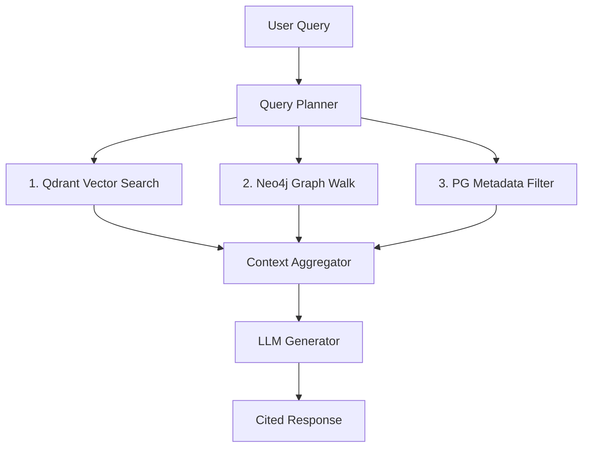

# Knowledge System Design: Brainy 1.0

This document defines how knowledge is represented, stored, and retrieved in Brainy 1.0.

## 1. Internal Knowledge Sources
Internal knowledge guides the platform's execution and ensures consistent rules:
- **Architectural Specifications & ADRs**: Located under `.ai/architecture/` and `.ai/decisions/`.
- **Requirements Specifications (PRDs/SRSs)**: Under `.ai/specifications/` templates and actual instances in `docs/`.
- **Graph Schema Design**: Graph blueprints and entity relationships constraints.
- **API Contracts**: OpenAPI definitions and Pydantic interfaces.

## 2. External Knowledge Sources
External knowledge is the unstructured video content ingested and processed:
- **YouTube Playlists & Channels**: Source streams of speech and visual context.
- **Technical Documentation & Research Papers**: Supplementary texts mapped alongside videos to add context to technical terminology.
- **Reference Tutorials**: Code structures parsed and linked to video timelines.

## 3. Hybrid Knowledge Retrieval Strategy
To answer queries accurately, Brainy uses a hybrid retrieval model consisting of three phases:

### Phase 1: Vector Search (Qdrant)
- Match the user query semantic vector against the `Chunk` and `Entity` vector embeddings.
- Returns the top $K$ most similar transcript chunks.

### Phase 2: Graph Traversal (Neo4j)
- For the top matched entities from Phase 1, query Neo4j to pull adjacent nodes and edges (1-hop or 2-hop).
- This extracts the relational context: *(Docker, USED_WITH, Kubernetes)* or *(FastAPI, CREATES, Endpoint)*.

### Phase 3: Relational Metadata Matching (PostgreSQL)
- Filter by video metadata constraints (e.g., limit results to videos published after a certain date, or specific channels).

### Phase 4: Context Aggregation
- Combine raw text chunks, relational facts, and metadata, feeding them to the LLM to generate responses with inline timestamps (e.g., `[Video Title, 12:45]`).
