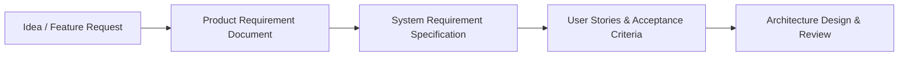
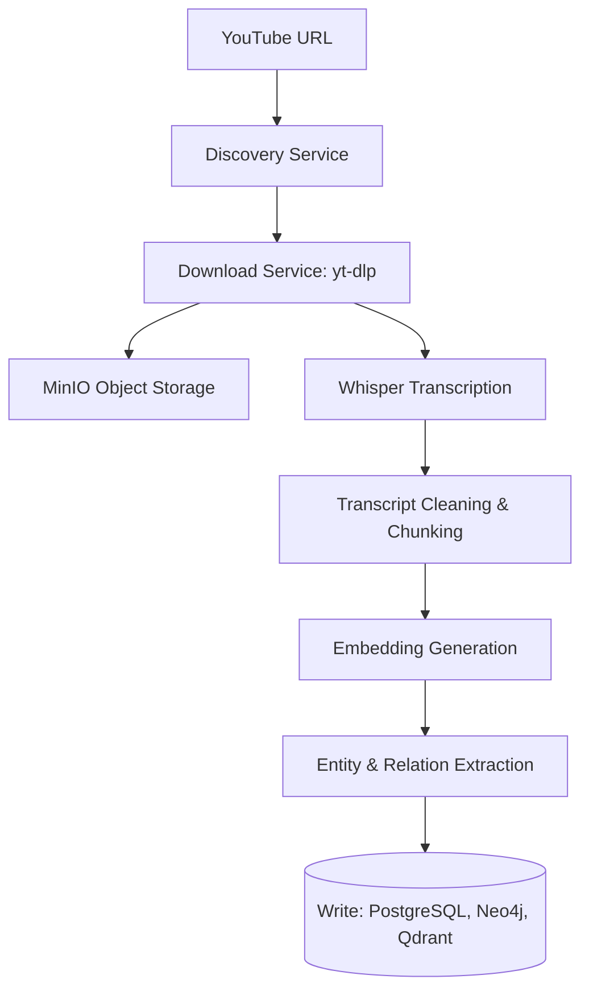
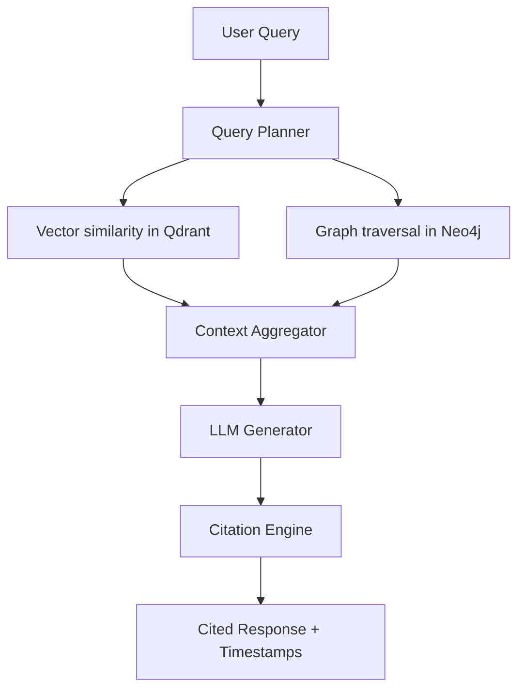
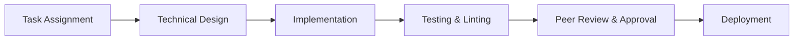

# Workflow Definitions: Brainy 1.0

This document defines the key workflows driving development and runtime features.

---

## 1. Requirement Workflow

1. **Idea / Feature Request**: Initiated by Product Manager Agent or human requests.
2. **PRD Creation**: PM Agent drafts product requirements.
3. **SRS Generation**: Requirements Engineer parses PRD and creates exact specifications.
4. **User Stories & Acceptance Criteria**: Written to guide QA and engineering tasks.
5. **Architecture Review**: System Architect validates changes against existing system designs.

---

## 2. Ingestion Workflow

1. **Discovery**: Channel, playlist, or video is checked, resolving metadata.
2. **Download**: Downloader worker downloads high-quality audio streams.
3. **Whisper Transcription**: Converts raw audio to formatted text with word-level timestamps.
4. **Cleaning & Chunking**: Paragraph formatting, word correction, and semantic chunking.
5. **Embeddings**: Vector embeddings generated for chunks and entities.
6. **Extraction**: LLM extracts entities and relations, compiling triplets.
7. **Storage**: Write operations commit metadata to PostgreSQL, relations to Neo4j, and vectors to Qdrant.

---

## 3. Query Workflow

1. **Query Planner**: Determines search pathways (local vs. global).
2. **Hybrid Search**: Concurrent execution of vector semantic searches and graph hop queries.
3. **Context Aggregator**: Collects matching transcript chunks and entity network contexts.
4. **LLM Generation**: Processes context to yield accurate responses.
5. **Citation Engine**: Appends playback links and timestamp metadata to the answer.

---

## 4. Development Workflow

1. **Task**: Pulled from `task.md` or backlog.
2. **Design**: Establish interface contracts or database changes.
3. **Implementation**: Code components according to PEP 8 standards.
4. **Testing**: Run unit and integration tests.
5. **Review**: Ensure compliance with code rules and architectural standards.
6. **Deployment**: Release builds to production/staging.
