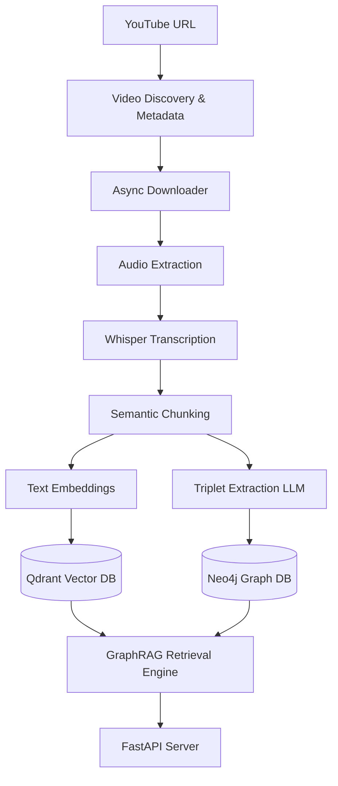

# 🧠 Brainy 1.0 - Video Intelligence & GraphRAG Platform

[](https://www.python.org/)
[](https://fastapi.tiangolo.com/)
[](https://www.docker.com/)
[](LICENSE)

Brainy 1.0 is an AI-powered Video Intelligence, Knowledge Graph, and Research platform designed to ingest YouTube playlists, channels, and videos, and transform them into dense, multi-hop semantic graphs. It integrates vector databases (Qdrant) and graph databases (Neo4j) to support state-of-the-art explainable retrieval (**GraphRAG**).

---

## 🏗️ System & Pipeline Architecture



---

## ⚡ Core Infrastructure Stack

The infrastructure contains 5 pre-configured service containers. Note that Postgres runs on port `5435` to avoid binding conflicts with host-level engines.

| Service | Technology | Port Map (Host:Container) | Data Volume | Purpose |
| :--- | :--- | :--- | :--- | :--- |
| **PostgreSQL** | Postgres 15 | `5435:5432` | `pg_data` | App state, metadata & migrations |
| **Neo4j** | Neo4j 5.12-community | `7474:7474`, `7687:7687` | `neo4j_data` | Knowledge Graph & GraphRAG queries |
| **Qdrant** | Qdrant latest | `6333:6333` | `qdrant_data` | Semantic vector space embeddings |
| **RabbitMQ** | RabbitMQ 3-management | `5672:5672`, `15672:15672` | Ephemeral | Message broker for task ingestion |
| **MinIO** | MinIO latest | `9000:9000`, `9001:9001` | `minio_data` | Audio & media blob storage |

---

## 🚀 Getting Started

### Prerequisites
- Python 3.11 or Python 3.13
- Docker Desktop or Docker Engine

### 1. Spin up the Databases
Launch the Docker cluster in the background:
```bash
docker compose -f infra/docker-compose.yml up -d
```

### 2. Set Up Environment Variables
Create your local `.env` configuration:
```bash
copy .env.example .env
```
Ensure you customize your API keys:
- `OPENAI_API_KEY`
- `GEMINI_API_KEY`

### 3. Install Dependencies
Install Python requirements:
```bash
pip install -r src/requirements.txt
```

### 4. Database Migrations (PostgreSQL)
Run Alembic migrations to build the initial schema:
```bash
alembic upgrade head
```

### 5. Launch the Server
Start the Uvicorn-based FastAPI backend:
```bash
$env:PYTHONPATH="."
uvicorn src.api.main:app --reload
```
Access the interactive documentation at [http://localhost:8000/docs](http://localhost:8000/docs).

---

## 📂 Repository Layout

```text
├── .ai/             # Agent configuration and instructions
├── docs/            # Platform specs, schemas, and design documents
├── infra/           # Docker Compose profiles, volumes, and network layers
├── src/
│   ├── api/         # FastAPI core, routers, and health checks
│   ├── configs/     # App config settings and environment parser
│   ├── domain/      # Database models and entity specs
│   ├── ingestion/   # YouTube scraping and download scripts
│   ├── workflows/   # Audio transcriptions, chunks, and ingestion tasks
│   └── migrations/  # Alembic database migrations
├── tests/           # Integration and E2E validation suites
└── pyproject.toml   # Linter configurations (black, isort, mypy)
```

---

## 🛠️ Operations & Utility Commands

### Health Check Endpoint
Query the API health check using curl:
```bash
curl http://localhost:8000/api/v1/health
```

Expected Response:
```json
{
  "status": "healthy",
  "services": {
    "postgres": "up",
    "neo4j": "up",
    "qdrant": "up",
    "rabbitmq": "up",
    "minio": "up"
  }
}
```

### Alembic Migrations
Generate a new auto-detected migration:
```bash
alembic revision --autogenerate -m "Add new schema fields"
```

---

## 🤝 Compliance & Community

We welcome contributions! Please review our guidelines before submitting a pull request:
- [CONTRIBUTING.md](CONTRIBUTING.md)
- [CODE_OF_CONDUCT.md](CODE_OF_CONDUCT.md)
- [GOVERNANCE.md](GOVERNANCE.md)

## 📄 License

This project is licensed under the Apache 2.0 License - see the [LICENSE](LICENSE) file for details.
